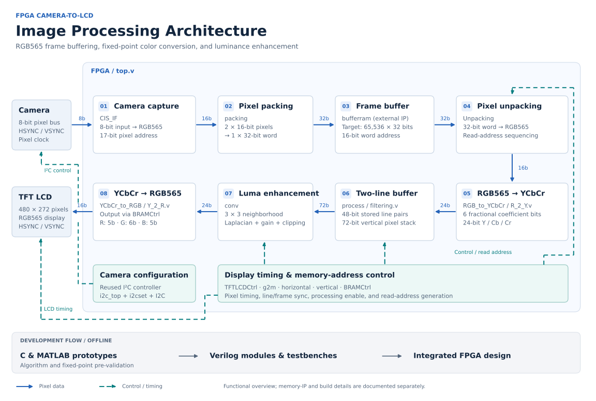

# FPGA 카메라–LCD 영상 처리

**480 × 272 카메라 영상을 처리해 LCD로 출력하는 Verilog 프로젝트**입니다. RGB565 프레임 버퍼, 고정소수점 RGB–YCbCr 변환, 휘도 향상 필터를 다룹니다.

**개발 순서:** C와 MATLAB으로 알고리즘과 고정소수점 연산을 먼저 검토한 뒤 Verilog로 구현했습니다. C·MATLAB 코드는 RTL 설계 전 사전 검증용이며, 실제 FPGA 영상 처리 경로에서 실행되는 소프트웨어 단계가 아닙니다.

**활용한 기존 모듈:** 카메라 설정용 I²C는 기존 구현을 활용했습니다. 직접 구현한 부분과 구분해 [출처·의존성 문서](docs/SOURCE_NOTES.md)에 기록했습니다.

[English](README.md) · [구조 설명](docs/ARCHITECTURE.md) · [빌드 상태](docs/BUILD_STATUS.md)

## 구현 내용

- 카메라의 8비트 입력을 16비트 RGB565 픽셀로 구성
- 두 픽셀을 32비트 메모리 워드로 패킹하고, 출력 시 언패킹
- 고정소수점 계수를 사용한 RGB565 ↔ YCbCr 변환
- 라인 버퍼와 가로 방향 레지스터를 이용한 3 × 3 이웃 픽셀 구성
- Laplacian 응답과 이득·클리핑을 적용한 휘도 향상
- LCD 동기 신호와 메모리 읽기 주소 생성

## 파일 구성

| 경로 | 역할 |
|---|---|
| `rtl/` | 최종 ZIP에 포함된 통합 Verilog 설계 |
| `constraints/` | 원본 보드 핀 설정 |
| `sim/original/` | 원본 테스트벤치 |
| `reference/c/` | RTL 구현 전 부동소수점·고정소수점 사전 검증 |
| `reference/matlab/` | 사전 알고리즘 검토, 중간 계산, 테스트 데이터 준비 |
| `tools/bmp2coe_legacy/` | 원본 BMP→COE 변환 프로그램 |
| `archive/` | 초기 카메라/LCD 설계, 패킹·색상 변환의 이전 버전 |
| `docs/` | 설계 설명, 영문 블록도, 빌드 상태, 원본 파일 대응표 |

## 현재 확인된 상태

현재 자료는 구현 과정과 소스를 보존한 아카이브입니다. 최종 소스만으로 바로 보드 빌드를 재현할 수 있는 상태는 아닙니다. `bufferram` 구현, 최종 포트에 맞는 `line_ram`, `I2C` 인터페이스의 실제 구현이 필요하며, 일부 원본 테스트벤치도 포트·폭이 맞지 않습니다.

정리 과정에서는 기존 알고리즘을 수정하지 않았습니다. HDL 시뮬레이션, 합성, 보드 동작, C/MATLAB과 RTL 간 수치 일치 여부도 새로 검증하지 않았습니다. 확인된 사항과 복원 순서는 [빌드 문서](docs/BUILD_STATUS.md)에 기록했습니다.

원본 ZIP 7개의 소스를 구분하고, 중복 최종 버전은 하나로 연결했습니다. 생성 파일과 샘플 이미지는 공개 패키지에서 제외했으며 원본 ZIP은 그대로 보관됩니다. 원본 경로·해시·이동 경로는 [파일 대응표](docs/source_manifest.csv)에서 확인할 수 있습니다.
